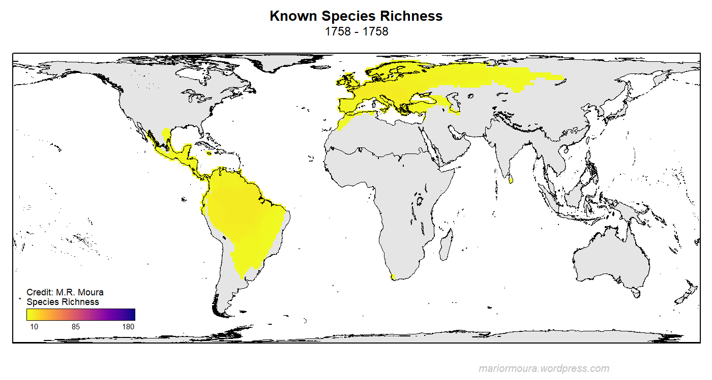

Supporting Information accompanying M. R. Moura & W. Jetz: "Shortfalls and opportunities in terrestrial vertebrate species discovery". In press. Nature Ecology and Evolution
====================================

 

### [View the new interactive map!](https://mol.org/patterns/discovery)

<!-- <iframe style="width: 100%; height: 600px;" src="https://mol.org/patterns/discovery?embed=true">

</iframe> -->
  

#### [Downloads](#downloads)

- Species-level data on taxonomic ranks, authority, year of description, and estimated discovery probability (including 95% CI) at the current time.
  - [Download CSV](https://data.vertlife.org/discoverypotential/SpeciesLevelData.zip) (~700KB Zip file)
- All code for running analyses and plotting figures is available on [GitHub](https://github.com/mariormoura/VertDiscoveries).

### Mapping opportunities for species discovery

  Our knowledge on Earth’s diversity is not static and since the beginning
  of modern taxonomy in 1758, more than 1,8 million of species have been
  described. But our planet likely has more than 10 million of species.
  For centuries explorers and taxonomists have worked hard to discover and
  describe species of terrestrial vertebrates:

 

 Animations of the change in species richness change over time for Amphibia as more
          species were discovered and described. See <a target="_blank" href="https://mol.org/patterns/discovery/background">background</a> for other taxa 

  <b><i>But many still remain undiscovered.</i></b>

<h3>Maps of discovery potential</h3>

  In the research represented on these pages we extrapolated the signal of
  past patterns of discovery into the future and developed a map of likely
  future discovery of new species! Check them out here:
  <a target="_blank" href="https://mol.org/patterns/discovery">mol.org/patterns/discovery</a>. The maps show
  the portion of total yet to be discovered species of a particular group
  of vertebrates that our models predict to be found in a particular
  region.

<h3>Our approach</h3>

  In the paper published in <b>Nature Ecology and Evolution</b> (<a
    href="https://dx.doi.org/10.1038/s41559-021-01411-5"
    >here</a
  >) we describe the approach. Our research took advantage of an
  unprecedent dataset including 11 biological, geographical, and
  sociological attributes computed for 32,172 species of amphibians,
  reptiles, mammals, and birds. Since the chances of being discovered and
  described early are not equal among species, we were able to use these
  species-level attributes to model the discovery probability of all known
  terrestrial vertebrate species and use those probabilities to construct
  metrics of discovery potential across different grid cells, taxa,
  countries, and biomes and realms.

<h3>Limits to interpretation</h3>

  Please note that we do not expect our geographic discovery projections
  to hold up in exact form. They are estimates that are a direct
  reflection of past description processes and their correlates, and any
  forward interpretation therefore needs to recognize intrinsic
  limitations. Notably, species represent scientific hypotheses that are
  sometimes revisited, refuted or revalidated. Our models therefore are
  not able to distinguish operational definitions of valid species and the
  potential heterogeneous associations arising from variable practices
  around, for example, recognizing cryptic species or splits. There may
  also be parts of the multivariate predictor space that lack data to
  inform the model and thus miss actual discovery opportunities.

<h3>Acknowledgments</h3>

  We gratefully acknowledge support from the National Geographic Society
  and E.O. Wilson Biodiversity Foundation for this work. The research is
  facilitated through the National Science Foundation VertLife project (<a
    href="http://vertlife.org"
    target="_blank"
    >http://vertlife.org</a
  >).

  